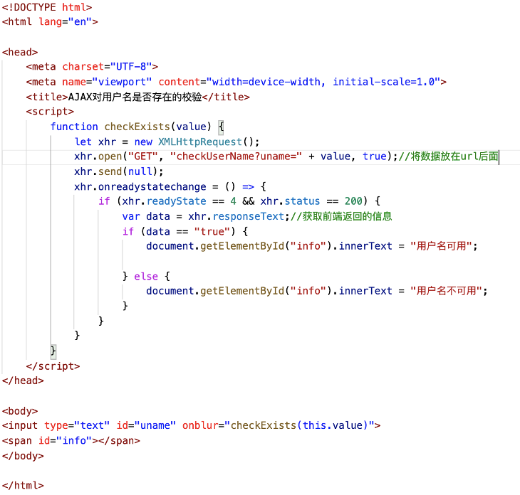
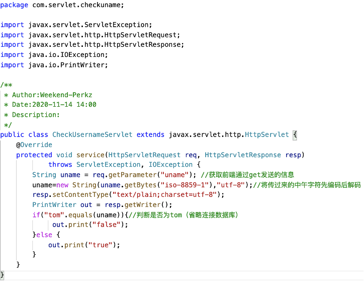

### AJAX

~~~~
（1）传统web表单请求整个页面都要重新加载，向服务器请求，这是同步加载，如果服务器响应不及时，那么就会造成页面阻塞，影响用户使用

（2）AJAX的应用场景，比如我们点击登陆，登陆完之后，登陆键消失或改成用户名，其他画面都不变，不会重新加载，再比如点赞之后页面也不会刷新
~~~~

##### 1.内容
~~~~
AJAX=Asynchronous JavaScript And XML就是异步加载JavaScript（JSON）和XML

使用XHTML+CSS来标准化呈现

使用XML和XSLT进行数据交换及相关操作

使用**XMLHttpRequest对象与Web服务器进行异步数据通信**

使用Javascript操作Document Object Model进行动态显示及交互

使用JavaScript绑定和处理所有数据

通过DOM修改页面元素，实现页面局部刷新

通过CSS改变样式，美化页面的效果，提升用户体验

与传统的web请求的区别

（1）发送请求方式不同

传统web：提交表单的方式发送请求

AJAX：异步引擎对象发送请求

（2）服务器响应不同

   传统web：响应的内容是一个完整画面

   AJAX：响应的内容只有请求的数据

（3）客户端处理方式不同

   传统web：需要等服务器响应完成并重新加载整个页面后客户才能进行操作

   AJAX：可以动态更新页面中的部分内容，用户不需要等待请求的响应
~~~~

 

##### 2.工作原理

­­­­

 

### **XMLHttpRequest对象是AJAX的基础**

~~~~
Ajax的一个最大的特点是无需刷新页面便可向服务器传输或读写数据(又称无刷新更新页面),这一特点主要得益于XMLHTTP组件XMLHTTPRequest对象。

（一）.方法
1.abort()	停止当前请求 
2.getAllResponseHeaders()	把HTTP请求的所有响应首部作为键/值对返回
3.getResponseHeader("header")	返回指定首部的串值
4.open("method","URL",[asyncFlag],["userName"],["password"]) 	建立对服务器的连接。method参数可以是GET、POST或PUT。url参数可以是相对URL或绝对URL（服务器的地址）。这个方法还包括3个可选的参数，是否异步，用户名，密码
5.send(content)	向服务器发送请求 （content发生请求的数据）
6.setRequestHeader("header", "value")	设置请求头信息，在设置任何首部之前必须先调用open()。设置header并和请求一起发送 ('post'方法一定要 )

（二）.事件
1.onreadystatechange状态改变的事件触发器，每个状态改变时都会触发这个事件处理器，通常会调用一个JavaScript函数
（三）.属性
1.readyState	请求的状态。有5个可取值：0 = 未初始化，1 = 正在加载，2 = 已加载，3 = 交互中，4 = 完成
2.responseText服务器的响应，返回数据的文本。
3.responseXML服务器的响应，返回数据的兼容DOM的XML文档对象 ，这个对象可以解析为一个DOM对象。
4.responseBody 服务器返回的主题（非文本格式）
5.responseStream服务器返回的数据流
6.status	服务器的HTTP状态码（如：404 = "文件末找到" 、200 ="成功" ，等等）
7.statusText	服务器返回的状态文本信息 ，HTTP状态码的相应文本（OK或Not Found（未找到）等等）
~~~~

##### 3.AJAX原生封装
~~~~javascript
var AJAX = new Object();
AJAX.HttpRequest = function (method, url, async, data, callback, username, password) {
    // 1.创建对象XMLHttpRequest对象
    var request = null;
    if (window.XMLHttpRequest) {
        request = new XMLHttpRequest();
    }
    else if (window.ActiveXObject) {
        request = new ActiveXObject("Microsoft.XMLHTTP"); //老版本IE
    }
    else {
        request = "浏览器版本过低";
    }
    // 2.设置参数
    if (request != null) {
        //规定数据类型，URL是否异步处理请求。
        request.open(method, url, async, username, password);
        //将请求发送到服务器，参数仅仅用于POST,不是POST就是null
        request.send(data);
        request.onreadystatechange = function () {
            if (request.readyState == 4 && request.status == 200) {
                if (callback) {
                    callback(request.responseText);
                }
            }
        }
    }
}
~~~~
##### 4.AJAX的优缺点

###### (1).AJAX的优点
~~~~
<1>.无刷新更新数据。
AJAX最大优点就是能在不刷新整个页面的前提下与服务器通信维护数据。这使得Web应用程序更为迅捷地响应用户交互，并避免了在网络上发送那些没有改变的信息，减少用户等待时间，带来非常好的用户体验。
<2>.异步与服务器通信。
AJAX使用异步方式与服务器通信，不需要打断用户的操作，具有更加迅速的响应能力。优化了Browser和Server之间的沟通，减少不必要的数据传输、时间及降低网络上数据流量。
<3>.前端和后端负载平衡。
AJAX可以把以前一些服务器负担的工作转嫁到客户端，利用客户端闲置的能力来处理，减轻服务器和带宽的负担，节约空间和宽带租用成本。并且减轻服务器的负担，AJAX的原则是“按需取数据”，可以最大程度的减少冗余请求和响应对服务器造成的负担，提升站点性能。
<4>.基于标准被广泛支持。
AJAX 基于标准化的并被广泛支持的技术，不需要下载浏览器插件或者小程序，但需要客户允许JavaScript在浏览器上执行。随着Ajax的成熟，一些简化 Ajax使用方法的程序库也相继问世。同样，也出现了另一种辅助程序设计的技术，为那些不支持JavaScript的用户提供替代功能。
<5>.界面与应用分离。
Ajax使WEB中的界面与应用分离（也可以说是数据与呈现分离），有利于分工合作、减少非技术人员对页面的修改造成的WEB应用程序错误、提高效率、也更加适用于现在的发布系统。
~~~~
###### (2).AJAX的缺点
~~~~
<1>.AJAX干掉了Back和History功能，即对浏览器机制的破坏
在动态更新页面的情况下，用户无法回到前一个页面状态，因为浏览器仅能记忆历史记录中的静态页面。一个被完整读入的页面与一个已经被动态修改过的页面之间的差别非常微妙；用户通常会希望单击后退按钮能够取消他们的前一次操作，但是在Ajax应用程序中，这将无法实现。
后 退按钮是一个标准的web站点的重要功能，但是它没法和js进行很好的合作。这是Ajax所带来的一个比较严重的问题，因为用户往往是希望能够通过后退来 取消前一次操作的。那么对于这个问题有没有办法？答案是肯定的，用过Gmail的知道，Gmail下面采用的Ajax技术解决了这个问题，在Gmail下 面是可以后退的，但是，它也并不能改变Ajax的机制，它只是采用的一个比较笨但是有效的办法，即用户单击后退按钮访问历史记录时，通过创建或使用一个隐 藏的IFRAME来重现页面上的变更。（例如，当用户在Google Maps中单击后退时，它在一个隐藏的IFRAME中进行搜索，然后将搜索结果反映到Ajax元素上，以便将应用程序状态恢复到当时的状态。）
但是，虽然说这个问题是可以解决的，但是它所带来的开发成本是非常高的，并与Ajax框架所要求的快速开发是相背离的。这是Ajax所带来的一个非常严重的问题。
一 个相关的观点认为，使用动态页面更新使得用户难于将某个特定的状态保存到收藏夹中。该问题的解决方案也已出现，大部分都使用URL片断标识符（通常被称为 锚点，即URL中#后面的部分）来保持跟踪，允许用户回到指定的某个应用程序状态。（许多浏览器允许JavaScript动态更新锚点，这使得Ajax应 用程序能够在更新显示内容的同时更新锚点。）这些解决方案也同时解决了许多关于不支持后退按钮的争论。
<2>.AJAX的安全问题
AJAX 技术给用户带来很好的用户体验的同时也对IT企业带来了新的安全威胁，Ajax技术就如同对企业数据建立了一个直接通道。这使得开发者在不经意间会暴露比 以前更多的数据和服务器逻辑。Ajax的逻辑可以对客户端的安全扫描技术隐藏起来，允许黑客从远端服务器上建立新的攻击。还有Ajax也难以避免一些已知 的安全弱点，诸如跨站点脚步攻击、SQL注入攻击和基于Credentials的安全漏洞等等。
<3>.对搜索引擎支持较弱
对搜索引擎的支持比较弱。如果使用不当，AJAX会增大网络数据的流量，从而降低整个系统的性能。
<4>.破坏程序的异常处理机制
至 少从目前看来，像Ajax.dll，Ajaxpro.dll这些Ajax框架是会破坏程序的异常机制的。关于这个问题，曾在开发过程中遇到过，但是查了一 下网上几乎没有相关的介绍。后来做了一次试验，分别采用Ajax和传统的form提交的模式来删除一条数据……给我们的调试带来了很大的困难。
<5>.违背URL和资源定位的初衷
例如，我给你一个URL地址，如果采用了Ajax技术，也许你在该URL地址下面看到的和我在这个URL地址下看到的内容是不同的。这个和资源定位的初衷是相背离的。
<6>.AJAX不能很好支持移动设备
一些手持设备（如手机、PDA等）现在还不能很好的支持Ajax，比如说我们在手机的浏览器上打开采用Ajax技术的网站时，它目前是不支持的。
<7>.客户端过肥，太多客户端代码造成开发上的成本
编写复杂、容易出错 ；冗余代码比较多（层层包含js文件是AJAX的通病，再加上以往的很多服务端代码现在放到了客户端）；破坏了Web的原有标准。
~~~~
##### 5.AJAX注意点及适用和不适用场景

###### (1).注意点
~~~~
Ajax 开发时，网络延迟——即用户发出请求到服务器发出响应之间的间隔——需要慎重考虑。不给予用户明确的回应，没有恰当的预读数据，或者对 XMLHttpRequest的不恰当处理，都会使用户感到延迟，这是用户不希望看到的，也是他们无法理解的。通常的解决方案是，使用一个可视化的组件来 告诉用户系统正在进行后台操作并且正在读取数据和内容。
~~~~
###### (2).Ajax适用场景
~~~~
<1>.表单驱动的交互
<2>.深层次的树的导航
<3>.快速的用户与用户间的交流响应
<4>.类似投票、yes/no等无关痛痒的场景
<5>.对数据进行过滤和操纵相关数据的场景
<6>.普通的文本输入提示和自动完成的场景
~~~~
###### (3).Ajax不适用场景
~~~~
<1>.部分简单的表单
<2>.搜索
<3>.基本的导航
<4>.替换大量的文本
<5>.对呈现的操纵
~~~~
##### 6.jQuery的AJAX方法
~~~~javascript
$(function () {
    var list = {}; //请求参数
    $.ajax({
        type: "POST", //请求方式
        contentType: "application/json;charset=UTF-8",//请求的媒体类型
        url: "http://127.0.0.1/admin/list/",//请求地址
        data: JSON.stringify(list), //数据，json字符串
        success: function (result) {//请求成功
            console.log(result);
        },
        error: function (e) {//请求失败，包含具体的错误信息
            console.log(e.status);
            console.log(e.responseText);
        }
    });
});
~~~~
~~~~
（1）url	必需。规定把请求发送到哪个 URL（服务器地址）。
（2）data可选。映射或字符串值。规定连同请求发送到服务器的数据。
（3）success(data, textStatus, jqXHR)	可选。请求成功时执行的回调函数。
（4）dataType可选。规定预期的服务器响应的数据类型。默认执行智能判断（xml、json、script 或 html）。
~~~~
~~~~javascript
$.ajax({
    type: 'POST',
    url: url ,
    data: data ,
    success: success ,
    dataType: dataType
});
~~~~
~~~~
$.ajax需要注意的一些地方
  （1）data数据主要方式有三种，html拼接的，json数组，form表单经serialize()序列化的；通过dataType指定，不指定智能判断。
  （2）$.ajax只提交form以文本方式，如果异步提交包含<file>上传是传过不过去,需要使用jquery.form.js的$.ajaxSubmit
~~~~

######（1.$.ajax带json数据的异步请求）
~~~~javascript
var aj = $.ajax( {  
    url:'productManager_reverseUpdate',//跳转到 action  
    data:{  
             selRollBack : selRollBack,  
             selOperatorsCode : selOperatorsCode,  
             PROVINCECODE : PROVINCECODE,  
             pass2 : pass2  
    },  
    type:'post',  
    cache:false,  
    dataType:'json',  
    success:function(data) {  
        if(data.msg =="true" ){  //登录成功
            // view("修改成功！");  
            alert("修改成功！");  
            window.location.reload( );  //刷新页面
        }else{  
            view(data.msg);  
        }  
     },  
     error : function() {  
          // view("异常！");  
          alert("异常！");  
     }  
});
~~~~
######（2.$.ajax序列化表格内容为字符串的异步请求）
~~~~javascript
function noTips(){  
    var formParam = $("#form1").serialize( );//序列化表格内容为字符串a=1&b=2 
    $.ajax({  
        type:'post',      
        url:'Notice_noTipsNotice',  
        data:formParam,  
        cache:false,  
        dataType:'json',  
        success:function(data){  
        }  
    });  
}  

~~~~
######（3.$.ajax拼接url的异步请求）
~~~~javascript
var yz=$.ajax({  
     type:'post',  
     url:'validatePwd2_checkPwd2?password2='+password2,  
     data:{},  
     cache:false,  
     dataType:'json',  
     success:function(data){  
          if( data.msg =="false" ) //服务器返回false，就将validatePassword2的值改为pwd2Error，这是异步，需要考虑返回时间  
          {  
               textPassword2.html("业务密码不正确！");  
               $("#validatePassword2").val("pwd2Error");  
               checkPassword2 = false;  
               return;  
           }  
      },  
      error:function(){}  
}); 
~~~~
######（4.$.ajax拼接data的异步请求）
~~~~javascript
$.ajax({   
    url:'<%=request.getContextPath()%>/kc/kc_checkMerNameUnique.action',   
    type:'post',   
    data:'merName='+values,   
    async : false, //默认为true 异步   
    error:function(){   
       alert('error');   
    },   
    success:function(data){   
       $("#"+divs).html(data);   
    }
});
~~~~

##### 1.同步请求
~~~~javascript
function sendSync() {
    //1.创建XMLHttpREquest对象
    var xhr = new XMLHttpRequest();
    //2.建立初始化连接
    xhr.open('GET', 'https://free-api.heweather.net/s6/weather/now?location=beijing&key=4693ff5ea653469f8bb0c29638035976Î', false);
    //3.发送请求
    xhr.send(null);
    //4.接收数据，在接受服务器响应之前，客户端无法做交互操作
    var data = xhr.responseText;
    console.log(data)
}
~~~~
##### 2.服务器没响应的异步请求
~~~~javascript
function sendAsync() {
    //1.创建XMLHttpREquest对象
    var xhr = new XMLHttpRequest();
    //2.建立初始化连接
    xhr.open('GET', 'https://free-api.heweather.net/s6/weather/now?location=beijing&key=4693ff5ea653469f8bb0c29638035976Î', true);
    //3.发送请求
    xhr.send(null);//客户端可以继续交互操作
    //4.接收数据
    var data = xhr.responseText;//无法获取响应数据，因为服务器没有来得及响应
    console.log(data)
}
~~~~
##### 3.等服务器响应完成的异步请求
~~~~javascript
function sendAsync2() {
    //1.创建XMLHttpREquest对象
    var xhr = new XMLHttpRequest();
    //2.建立初始化连接
    xhr.open('GET', 'https://free-api.heweather.net/s6/weather/now?location=beijing&key=4693ff5ea653469f8bb0c29638035976Î', true);
    //3.发送请求
    xhr.send(null);//客户端可以继续交互操作
    //4.接收数据
    xhr.onreadystatechange = () => {//监听等服务器响应了
        if (xhr.readyState == 4 && xhr.status == 200) { //&&两边的顺序不能颠倒了
            var data = xhr.responseText;
            console.log(data)
        }
    }
}
~~~~
~~~~
XMLHttpRequset即支持发送同步请求，也支持发送异步请求
同步请求：在服务器响应之前浏览器处于阻塞状态，等待服务器的响应，此时无法做交互操作
异步请求：在服务端响应之前浏览器可以执行其他操作，无需等待服务端响应，但是服务器来不及响应，所以要根据readyState判断状态，用onreadystatechange监听
http状态码（status）：200时候是正常，这是监听服务器是否正常
~~~~

 

 

##### 使用GET方式发送请求

###### 前端：

****

 

###### 后端：

****

###### 使用POST方式发送请求（也可以通过url发送，相当于使用GET）后端不变

****

### GET和POST的区别
~~~~
GET： 通过URL发送数据，显示在地址栏
      传递数据大小有限
      字符集会被转化为ISO-8859-1，需要后端解码成utf-8
POST：数据通过请求头发送，需要设置请求头
      数据大小理论上没有限制
      在请求头就已经设置好了utf-8，后端能自动识别
~~~~
~~~~javascript
function doLogin() {
            let username = $("#username").val();
            let password = $("#password").val();
            let xhr = new XMLHttpRequest();
            xhr.open("POST", 'login', true);
            xhr.setRequestHeader("Comtent-Type", "application/x-www-form-urlencoded;charset=utf-8");
            xhr.send({
                "username": username,
                "password": password
            });
            xhr.onreadystatechange = () => {
                if (xhr.readyState == 4 && xhr.status == 200) {
                    // 假设后台返回true或false
                    let data = xhr.responseText;//如果传回来是json
                    if (data == "true") {
                        //校验成功
                        $("#loginInfo").html("登录成功"+username);
                    } else {
                        //校验失败
                        $("#loginInfo").html("密码不正确");
                    }
                }
            }
        }
~~~~
 ### AJAX-jQuery
 ~~~~
 * 传统方式实现Ajax的不足
         * 1.步骤繁琐
         * 2.浏览器兼容有问题
         * jQuery常用的方法
         * 1.$.ajax()发送HTTP请求加载远程数据，最底层实现AJAX
         * 2.$.get()发送HTTP GET请求从服务器加载数据
         * 3.$.post()发送HTTP POST请求从服务器加载数据
         * 4.$.getJSON()发送HTTP请求 从服务器加载JSON数据
         * 5.$(elem).load()发送Ajax请求从服务器加载数据，并把返回的数据放置到指定元素中，最简单的方法
         *
         * $.ajax({});
         * 常用属性参数
         * String type   请求方法（GET/POST）默认GET
         * String url    发送请求的地址，默认为当前页地址
         * boolean async 请求模式，默认是true,异步
         * Object data/String data 发送给服务器的数据
         * String dataType返回的数据类型，包括（XML,HTML,Script,JSON,JSONP,text(默认)）
         * Number timeout 设置请求超时时间
         * boolean global 表示是否全局出发Ajax事件，默认为true
         * 常用函数参数
         * function success(Object result,String ts)成功后的回调函数（成功返回的数据，描述的请求类型字符串（可选））
         * function error(XMLHttpRequest xhr,String em,Exception e)失败的回调函数（xhr,错误信息，异常对象（三个都是可选项））
         * function beforeSend(XMLHttpRequset xhr（可选）)发送请求前调用的函数
         * function complete(XMLHttpRequest xhr,String ts)无论成功或者失败都可以调用的函数（xhr,描述请求字符（都可选））
~~~~
~~~~javascript
        function doLogin() {
            let username = $("#username").val();
            let password = $("#password").val();
            //使用$.ajax({})
            $.ajax({
                type: "post",
                url: "login",
                async: true,
                data: {
                    "username": username,
                    "password": password
                },
                dataType: "text",
                success: function (data, ts) {
                    if (data == "true") {
                        //校验成功
                        $("#loginInfo").html("登录成功" + username);

                    } else {
                        //校验失败
                        $("#loginInfo").html("密码不正确");
                    }
                }
            });
        }
~~~~
##### 数据格式
~~~~
在服务器端AJAX是一门与语言无关的技术，在业务逻辑层使用何种服务器都可以
从服务器端接收数据的时候，那些数据必须以浏览器能够理解的格式来发送，服务器端的编程语言只能返回三个格式的数据：纯字符串文本、XML、JSON
~~~~

##### Ajax的跨域请求
~~~~
URL=协议+服务器地址+端口号+路径+资源+传的参数+锚点+身份校验
如果协议、服务器地址、端口号中任何一个不同就是跨域

资源访问的路径，三种
1.相对路径    ../
2.绝对路径以服务器作为起始路径   /ajax/js/jquery.js
3.指定URL    http://localhost:8080/ajax/js/jquery.js
4.在头部配置base便签，指定当前页面路径的根路径 <base href = “http://localhost:8080/ajax”> 
在获取资源的时候直接写资源名就可以

API数据提供平台
聚合数据 https://www.juhe.cn/
百度APIstore http://apistore.baidu.com/
HaoService http://www.haoservice.com/

Ajax是无法直接跨域
解决跨域的三种方法：JSONP、CORS、iframe

JSONP = JSON with Padding
标签是支持跨域，script link...

使用script标签发送跨域请求
~~~~
~~~~javascript
//假设这个不跨域
let doSyncOne = () => {
    $.ajax({
        type: "get",
        url: "http://localhost:8080/ajax/hello",//向hello发送请求            
        dataType: "json",
        success: data => {
            console.log(data)
        }

    });
}
//从聚合数据平台获取数据，肯定跨域了
let doSyncTwo = () => {
    let xhr = new XMLHttpRequest();
    let url = "http://web.juhe.cn:8080/finance/exchange/rmbquot?key=5d1b54f0f89c78eabfef27d74116eafe&type=1";
    xhr.open("GET", url, true);
    xhr.send(null);
    xhr.onreadystatechange = () => {
        if (xhr.readyState == 4 && xhr.status == 200) {
            let data = xhr.responseText;
            console.log(data);//取不到数据
        }
    }
}
~~~~
~~~~javascript
//利用script做跨域请求
function handle(data) {
    //data就是我们需要的json数据            
}
let doSend = () => {
    let script = document.createElement("script");
    script.src = "http://127.0.0.1:8080/ajax2/jsonp?callback=handle"//并且传参数callback
    document.body.appendChild(script);
}
~~~~
~~~~javascript
//跨域请求API数据
function handle(data) {
    //获取json数据
    console.log(data)
}
let doSend2 = () => {
    let script = document.createElement("script");
    script.src = "http://web.juhe.cn:8080/finance/exchange/rmbquot?key=5d1b54f0f89c78eabfef27d74116eafe&dtype=jsonp&callback=handle"//并且传参数callback
    document.body.appendChild(script);
}
~~~~
##### jQuery的跨域请求
~~~~javascript
let doSend = () => {
    //自动生成分url：http://apis.juhe.cn/simpleWeather/query?city=%E8%8B%8F%E5%B7%9E&key=08295a8ae659b8645fa4122783103a18&dtype=jsonp&callback=jQuery3510935084820648854_1605442777185&_=1605442777186
    //第一个参数：JSONP参数，参数名是callback，参数值是jQuery******
    //第二个参数：为了解决浏览器缓存数据的问题，表示当前时间的毫秒数，参数名为_
    $.ajax({
        type: "get",//jsonp只支持get请求
        url: "http://apis.juhe.cn/simpleWeather/query?city=%E8%8B%8F%E5%B7%9E&key=08295a8ae659b8645fa4122783103a18&dtype=jsonp",
        dataType: "jsonp",//写json就是普通ajax请求，我发跨域
        jsonpCallback: "handle",//指定回调函数名，其他地方无需修改
        success: data => {
            console.log(data);
        },
        error: err => {
            console.log("请求失败");
        }
    });
}
~~~~

##### CORS的跨域请求
~~~~
服务器端允许跨域，设置响应头Access-Control-Allow-Origin值为*
客户端会自动在请求头添加一个Origin字段
